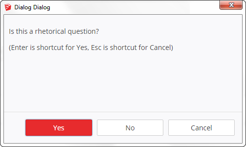

# Dialogs

 

Dialogs is a lightweight, easy to use library for SketchUp HtmlDialog
dialogs. It is designed purely using web technologies, no Ruby, to allow you to
easily implement it in dialogs in existing projects, without having to replace
Ruby HtmlDialogs with some custom dialog object. Working directly in web
technologies, rather than through a Ruby wrapper, also allows you to make more
versatile dialogs with highly specialized content and any third party lib of
your choice. Dialogs can be thought of as a utility library rather than a full
framework.

Dialogs consists of 2 separate modules that can be used both together or alone.
If you like the visual appearance but think my Javascript skills are rubbish,
you can use the style module only. If you like the javascript behavior, but want
styling according to your own brand, you can leave out the styling module.

## Controls

The controls module helps with dialog functionality.

Features:
- Automatically add callback actions to controls based on their class
- Assign shortcut keys to some standard controls
- Implement access keys to controls

For some sort of documentation, see the [somewhat complete example](examples/controls.html).

## Commit Button Order

The commit button order module helps ordering commit buttons consistent to the OS.

For some sort of documentation, see the [somewhat complete example](examples/commit-order.html).

## General Examples

````ruby
# Simple message box.
base_dir = UI.select_directory(title: "Locate modules/")
html = <<-HTML
  <!DOCTYPE HTML>
  <html>
    <head>
      <meta charset="UTF-8">
      <base href="#{base_dir}/" />
      <script src="jquery-1.12.4.js"></script>
      <script src="controls.js"></script>
      <link rel="stylesheet" type="text/css" href="commit-order.css">
      <script src="commit-order.js"></script>
      <link rel="stylesheet" type="text/css" href="style.css">
      <script>
        // Initialize the controls when the document is ready.
        $(document).ready(function() {
          Controls();
          commitOrder();
        } );
      </script>
    </head>
    <body>
      <div class="dlg-content-area">
        <p>
          This is a dialog window.
        </p>
        <p>(Both Enter and Esc are shortcuts for OK)</p>
      </div>
      <div class="dlg-commit-buttons">
        <button class="dlg-default-action dlg-callback-ok dlg-button">OK</button>
      </div>
    </body>
  </html>
HTML
dialog = UI::HtmlDialog.new(
  dialog_title: "Dialog Dialog",
  width: 500,
  height: 300,
  resizable: false
)
dialog.center
dialog.set_html(html)
dialog.add_action_callback("ok") { puts "OK" }
dialog.show
````

````ruby
# Yes No Cancel
base_dir = UI.select_directory(title: "Locate modules/")
html = <<-HTML
  <!DOCTYPE HTML>
  <html>
    <head>
      <meta charset="UTF-8">
      <base href="#{base_dir}/" />
      <script src="jquery-1.12.4.js"></script>
      <script src="controls.js"></script>
      <link rel="stylesheet" type="text/css" href="commit-order.css">
      <script src="commit-order.js"></script>
      <link rel="stylesheet" type="text/css" href="style.css">
      <script>
        // Initialize the controls when the document is ready.
        $(document).ready(function() {
          Controls();
          commitOrder();
        } );
      </script>
    </head>
    <body>
      <div class="dlg-content-area">
        <p>Is this a rhetorical question?</p>
        <p>(Enter is shortcut for Yes, Esc is shortcut for Cancel)</p>
      </div>
      <div class="dlg-commit-buttons">
        <span class="dlg-reverse-on-mac">
          <button data-access-key="y" class="dlg-default-action dlg-callback-yes
          dlg-button dlg-button-call-to-action">Yes</button>
          <button data-access-key="n" class="dlg-callback-no dlg-button">No</button>
          <button class="dlg-callback-cancel dlg-button">Cancel</button>
        </span>
      </div>
    </body>
  </html>
HTML
dialog = UI::HtmlDialog.new(
  dialog_title: "Dialog Dialog",
  width: 500,
  height: 300,
  resizable: false
)
dialog.center
dialog.set_html(html)
dialog.add_action_callback("yes")    { puts "Yes" }
dialog.add_action_callback("no")     { puts "No" }
dialog.add_action_callback("cancel") { puts "Cancel" }
dialog.show
````
